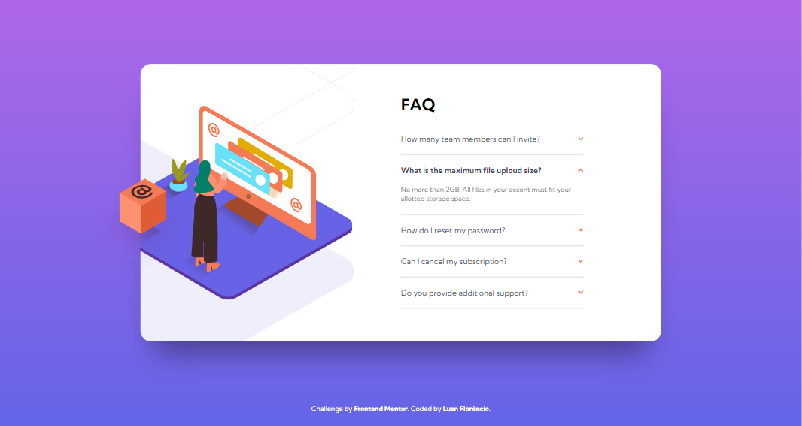

# Frontend Mentor - FAQ accordion card solution

_Challenge by [Front Mentor](https://www.frontendmentor.io/home)._

## Table of contents

- [Overview](#overview)
  - [The challenge](#the-challenge)
  - [Screenshot](#screenshot)
  - [Links](#links)
- [My process](#my-process)
  - [Built with](#built-with)
  - [What I learned](#what-i-learned)
  - [Continued development](#continued-development)
- [Author](#author)

## Overview

### The challenge

Users should be able to:

- View the optimal layout for the component depending on their device's screen size
- See hover states for all interactive elements on the page
- Hide/Show the answer to a question when the question is clicked

### Screenshots

- Desktop version:


> 1440x768 resolution

- interactivity:


- Mobile version:


> 375x768 resolution

### Links

- Solution URL: [My solution](https://www.frontendmentor.io/solutions/faq-accordion-card-with-javascript-YmyPqoEhY)
- Live Site URL: [FAQ accordion card](https://LuanFlorencioo.github.io/FAQ_accordion_card/)

## My process

### Built with

- Semantic HTML5 markup
- CSS custom properties
- Media Queries
- Flexbox
- Mobile-first workflow
- Keyframes animations
- Accordion effect made with Javascript

### What I learned

It's always good to reinforce our learnings, whether in projects, challenges, or in life itself.

Everything has its way of acquiring knowledge, and it was no different in this project. I was able to put into practice some of my knowledge acquired in HTML, CSS and javascript, but I also learned new things during development, such as interactivity when the mouse is over the question not activated. See the code snippet of the solution that I could think of below:

```css
  /* styles/main.css | row 84 */

.question:not(.active):hover {
  color: var(--soft-red);
}
```

Explaining the code above, I used for the first time a double selector selection in CSS for the question that doesn't have the "active" class and has the mouse cursor above it.

As for the javascript interactivity, I wanted to put the accordion interaction in the arrows that were at the end of the question on the right side. With that, I inserted the arrow images inside the "dt" tags, and in the javascript, I added their respective effects.

```js
// js/accordion.js  | row 22
const arrow = e.target;
const question = e.path[1];
const answer = e.path[1].nextElementSibling;

  if (arrow.classList.contains('active')) {
    [question, answer, arrow].forEach(item => item.classList.toggle('active'));
  }
  else {
    [allQuestions, allAnswers, allArrows].forEach(item => item.forEach(items => items.classList.remove('active')));
    [question, answer, arrow].forEach(item => item.classList.toggle('active'));
  };
```

I know that I didn't use the resources of the ReactJs library, however, I intend to work using its availability in the future. It makes the application easier with usability of components, which in this case, would also work perfectly in the accordion interaction.

### Continued development

As for the ongoing development inherited from this project, I intend to further study positioning in CSS, exclusively in flexbox and relative position. I need to improve, and with the future, doing new challenges and projects, the idea is to become more practical and natural.

## Author


_Luan Florêncio_

- GitHub - [LuanFlorencioo](https://github.com/LuanFlorencioo)
- Frontend Mentor - [@LuanFlorencioo](https://www.frontendmentor.io/profile/LuanFlorencioo)
- Twitter - [@LuanF_dev](https://www.twitter.com/LuanF_dev)